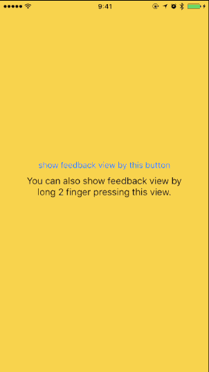

# FeedbackKit
feedback tool for iOS app



## Feature
- [x]Send feedback by mail
- [x]Send feedback by custom action
- []Mask privacy info before getting screen capture

You can also send feedback to a platform, such as Slack by using custom action.

## Requirements
- iOS8.0+
- Xcode 7.3+

## Installation
### CocoaPods
[CocoaPods](http://cocoapods.org) is a dependency manager for Cocoa projects. You can install it with the following command:

```bash
$ gem install cocoapods
```
> CocoaPods 0.39.0+ is required to build FeedbackKit.

To integrate FeedbackKit into your Xcode project using CocoaPods, specify it in your `Podfile`:

```ruby
source 'https://github.com/CocoaPods/Specs.git'
use_frameworks!

pod 'FeedbackKit'
```

Then, run the following command:

```bash
$ pod install
```

### Carthage
Comming soon (Welcome Pull Request)

## Usage
### Show feedback-view for sending feedback to one user by Email
```swift
import FeedbackKit

let emailConifg = Feedback.EmailConfig(to: "hoge@hogehogehoge.jp")
Feedback.Email(emailConfig: emailConifg).show {
    print("dismissed")
}
```

### Show feedback-view for sending feedback to multiple users by Email, and setting custom mail subject
```swift
let emailConfig = Feedback.EmailConfig(toList:
                    ["hoge1@hogehogehoge.jp",
                     "hoge2@hogehogehoge.jp"])
emailConfig.ccList = ["hoge3@hogehogehoge.jp",
                      "hoge4@hogehogehoge.jp"]
emailConfig.bccList = ["hoge5@hogehogehoge.jp",
                       "hoge6@hogehogehoge.jp"]
emailConfig.mailSubject = "custom mail subject"
Feedback.Email(emailConfig: emailConfig).show {
    print("## dismissed")
}
```

### Show feedback-view by 2 finger long press
Please use 'addDoubleLongPressGestureRecognizer' method, do not use 'show' method.
```swift
let emailConifg = Feedback.EmailConfig(to: "hoge@hogehogehoge.jp")
Feedback.Email(emailConfig: emailConifg).addDoubleLongPressGestureRecognizer {
    print("dismissed")
}
```

### Show feedback-view for sending feedback to Slack by using custom action
Please use 'Custom' enum.
At first, please let me explain a basic rule of custom action.
If you use 'Custom' enum, you must call 'success' method when custom action was finished successfully.
If you do not call 'success' method, feedback-view will not be disappeared.
```swift
Feedback.Custom { (feedbackViewController, sendInformation, success) in
    print("custom action")
    success() // important method
}.show {
    print("dismissed")
}
```

Next, let's implement a logic for sending to Slack.
I think that using SlackKit is a shortcut of goal.

If you use cocoapods, please add SlackKit as follows.
```ruby
pod 'SlackKit'
```

and you need to get slack's web api token.

useful link for creating slack's web api token as follows.
https://api.slack.com/docs/oauth-test-tokens

```swift
import SlackKit

Feedback.Custom { (feedbackViewController, sendInformation, success) in

    let token = "please put your slack's web api token"
    let bot = SlackKit(withAPIToken: token)
    guard let client: Client = bot.clients[token] else {
        return
    }
    guard let imageData = sendInformation.captureImageData else {
        return
    }

    let selectedTitle = sendInformation.selectedTitle ?? ""
    let comment = sendInformation.comment ?? ""
    let reporterName = sendInformation.reporterName ?? ""
    let className = sendInformation.className ?? ""

    client.webAPI.uploadFile(imageData, filename: "feedback", channels: ["#image_upload_your_channel"], success: { (file) in

            guard let imageUrl = file.urlPrivate else {
                return
            }

            let attachment = Attachment(fallback: "You got new feedback", title: selectedTitle,   text: "\(className) : \(comment) by \(reporterName)", imageURL: imageUrl)

            // text and image
            client.webAPI.sendMessage("#feedback_your_channel", text: "You got new feedback", username: "feedback",
                attachments: [attachment],
                success: { (complete:(ts: String?, channel: String?)) in
                    print("## message success ")
                    success() // important method. need to call this method for dismiss feedback view
                }, failure: { (error) in
                    print("## message fail \(error)")
            })
        }) { (error) in
            print("## upload failure")
    }
}.show {
    print("dismissed")
}
```
